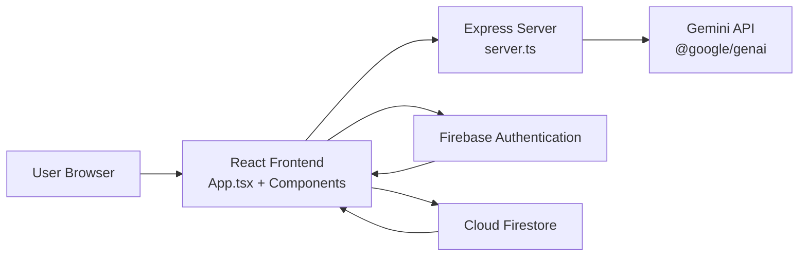

# visitaSL AI Assistant

An AI-powered Sri Lanka travel planning web application built with React, Firebase, and Google Gemini.

The app helps users:
- Sign in with Google
- Chat with an AI trip assistant
- Generate detailed itineraries
- Save chat sessions and trip plans
- Manage travel preferences (budget, language, transport, response style)

## Highlights

- AI travel recommendations tailored to user preferences
- Itinerary generation with day-by-day planning
- Firebase Authentication (Google sign-in)
- Firestore persistence for users, chats, and trips
- Real-time UI updates with Firestore listeners
- Fallback and retry handling for Gemini API transient errors
- Maps link normalization to avoid broken short links

## Tech Stack

### Frontend
- React 19
- TypeScript
- Vite 6
- Tailwind CSS 4
- Motion (animations)
- Sonner (toast notifications)
- Lucide React (icons)

### Backend / Runtime
- Express 4
- TSX (TypeScript runtime for dev server)

### AI
- Google GenAI SDK (`@google/genai`)
- Gemini Flash model family with model fallback support

### Database and Auth
- Firebase Authentication
- Cloud Firestore

## System Architecture



This app uses a React client as the main UI layer, Express for local runtime/middleware, Gemini for AI response generation, and Firebase for authentication plus real-time data storage.

## Project Structure

```
src/
  components/         UI components (Auth, ChatInterface, Sidebar, PlannerPanel, etc.)
  services/           External service integrations (Gemini)
  firebase.ts         Firebase app, auth, and firestore setup
  App.tsx             Main app logic and state orchestration
  main.tsx            React bootstrap
server.ts             Express + Vite middleware server
firebase-applet-config.json  Firebase web config
```

## Setup

### Prerequisites
- Node.js 18+
- Firebase project with Authentication and Firestore enabled
- Gemini API key

### 1) Install dependencies

```bash
npm install
```

### 2) Create local environment file

Create `.env.local` at project root.

Example:

```env
GEMINI_API_KEY=your_gemini_api_key
APP_URL=http://localhost:3000

# Gemini tuning (optional)
ENABLE_GOOGLE_SEARCH=false
GEMINI_FAST_MODE=true
GEMINI_MAX_CONTEXT_MESSAGES=10
GEMINI_MAX_OUTPUT_TOKENS=1400
GEMINI_DETAILED_MAX_OUTPUT_TOKENS=3200
GEMINI_ITINERARY_MAX_OUTPUT_TOKENS=3800
GEMINI_RETRY_ATTEMPTS=3
GEMINI_RETRY_BASE_DELAY_MS=1200
```

### 3) Configure Firebase

1. Update Firebase app config in `firebase-applet-config.json`.
2. In Firebase Console:
   - Enable Google provider in Authentication -> Sign-in method.
   - Add authorized domains in Authentication -> Settings:
     - `localhost`
     - `127.0.0.1`
     - your LAN IP (if testing from another device)
3. Ensure Firestore is created and rules are configured.

### 4) Run the app

```bash
npm run dev
```

Open:

http://localhost:3000

## Available Scripts

- `npm run dev` -> Start development server (Express + Vite middleware)
- `npm run build` -> Build production bundle
- `npm run preview` -> Preview production build
- `npm run lint` -> Type-check only (`tsc --noEmit`)

## How Data Flows

1. User signs in with Google.
2. App listens to auth state and syncs profile/settings in Firestore.
3. User sends a message.
4. Message history and user settings are sent to Gemini service.
5. AI response is saved to Firestore and rendered in chat.
6. Trip-like responses can be parsed and stored under user trips.

## Troubleshooting

### Google Sign-in fails with unauthorized-domain

Add your domain to Firebase Authentication authorized domains.

### Gemini API key missing

Confirm `.env.local` includes `GEMINI_API_KEY` and restart server.

### Gemini 429 (quota exceeded)

Check quota and billing in Google AI Studio / Google Cloud project.

### Gemini 503 (high demand)

Temporary provider overload. Retry after a few seconds.
The app includes retry and model fallback logic, but spikes can still occur.

### Port 3000 already in use

Stop previous server process and run again.

## Security Notes

- Never commit real API keys to public repositories.
- Keep `.env.local` private.
- Rotate keys immediately if exposed.

## License

Use your preferred project license (MIT recommended for open-source projects).
